class: font200

# Learning Goals for this Week

TBD

---
class: font160
# Today's Agenda 

Three papers:

* [A Comparison of Approaches to Advertising Measurement: Evidence from Big Field Experiments at Facebook][gordon]
  * Gordon, Zettelmeyer, Bhargava and Chapsky (2019,  Marketing Science)
* [Tweeting as a Marketing Tool – Field Experiment in the TV Industry][gong]
  * Gong, Zhang, Zhao and Jiang (2017, Journal of Marketing Research)
* [Can Your Advertising Really Buy Earned Impressions? The Effect of Brand Advertising on Word of Mouth][lovett]
  * Lovett, Peres and Xu (2019, Quantitative Marketing and Economics)

[gordon]: https://papers.ssrn.com/sol3/papers.cfm?abstract_id=3033144
[gong]: https://dspace.mit.edu/handle/1721.1/120756
[lovett]: https://link.springer.com/article/10.1007/s11129-019-09211-9

---
class: inverse, center, middle

# Approaches to Advertising Measurement

---
# Measuring Ad Effectiveness

**Motivation**: Measuring the causal effect of digital advertising

**Specific Questions**:

* What **is** the effect?
* Can we reliably estimate the effect without RCTs?

**How?**: Large scale experiments (15) at Facebook

* Note: This paper is **very** cool
* The authors are *extremely* careful in their explanations

---
# Advertising on Facebook

* Ads appear in the News Feed

```{r, echo = FALSE, fig.align = "center", out.width="80%"}
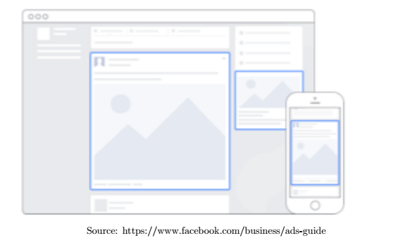
```

* Advertiser chooses target demographic(s), users then exposed to treatment / control

---
# Endogeneity Abounds Us (Them)

Concern: Sources of selection bias (Why?)

**User Induced Endogeneity**

* 'Activity bias' - user must be on Facebook during campaign to be exposed

**Targeting Induced Endogeneity**

* Ad delivery system optimizes whom to show ads 

**Competition Induced Endogeneity**

* Displaying ad $\implies$ won an auction  $\implies$ exposed users are highly values (higher expected conversion probability)

$\implies$ estimating causal effects without an RCT will be tough!

---
# What are they Measuring?

**Average Treatment Effect on the Treated**:  effect of the ads on users who are actually exposed to ads

**Lift**


```{r, echo = FALSE, fig.align = "center", out.width="100%"}
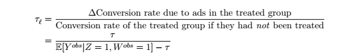
```

---
# Data


```{r, echo = FALSE, fig.align = "center", out.width="100%"}
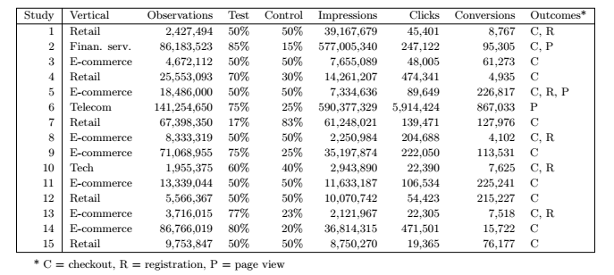
```

---
# RCT Results 


```{r, echo = FALSE, fig.align = "center", out.width="100%"}
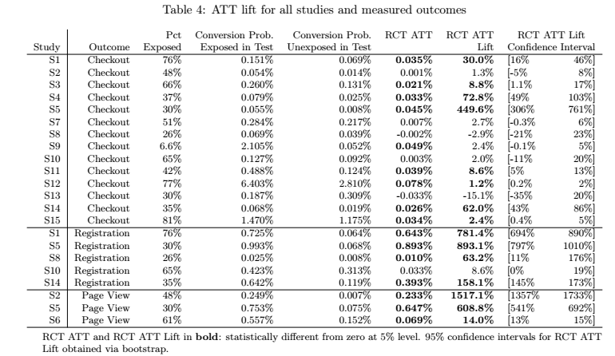
```

---
# Observational Approaches


```{r, echo = FALSE, fig.align = "center", out.width="100%"}
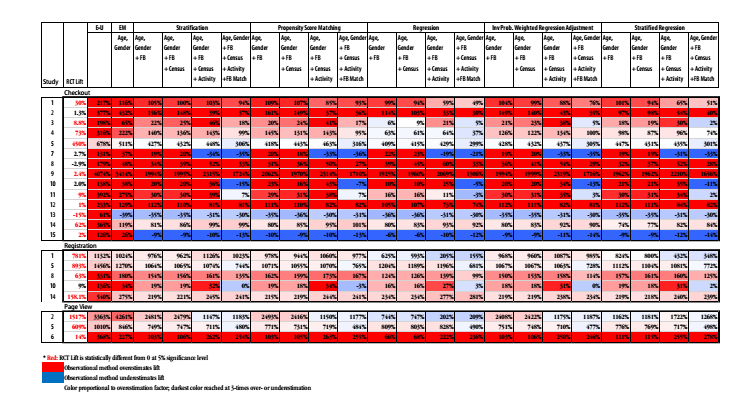
```

---
# Main Takeaways

* **RCTs are the gold standard for measuring ad effectiveness**
  * Insignificant differences for checkout conversion in 6/15 experiments
  * Significant for registration and page views almost always

* **Observational models generally overestimate lift**
  * Can be wrong by a factor of 3
  * 'Better' for registrations and page views than checkout

---
class: inverse, center, middle
# Tweeting as a Marketing Tool

---
# Do Firm Tweets Matter?

**Motivation**: Does tweeting increase demand for their products

**Specific Questions**:

* What is the causal effect of company tweets on demand?
* Do retweets by influential users help?

**How?**: Large scale experiment on Weibo w/ a media company

* Note: (again) This paper is **very** cool

---
# The Experiment

Weibo $\approx$ Chinese Twitter

Industry: documentary TV shows, one show broadcast per day across seven local channels

```{r, echo = FALSE, fig.align = "center", out.width="100%"}
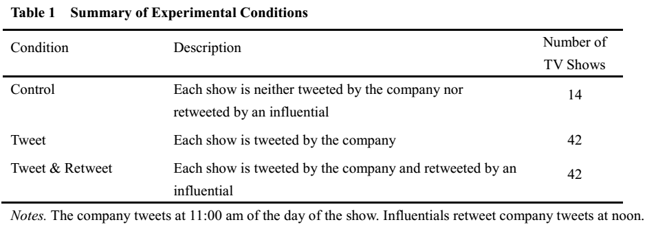
```

---
# Results

```{r, echo = FALSE, fig.align = "center", out.width="63%"}
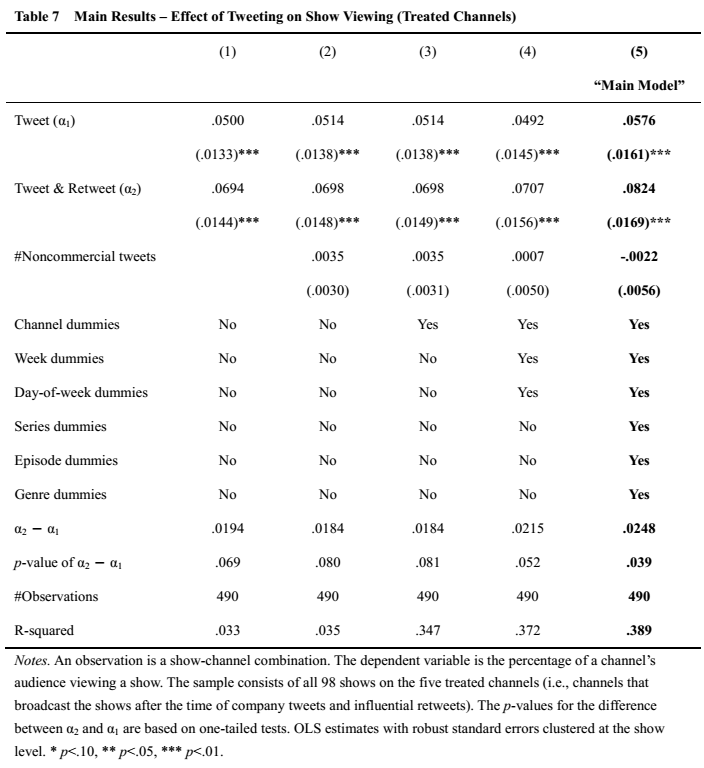
```

---
# Results II 

```{r, echo = FALSE, fig.align = "center", out.width="100%"}
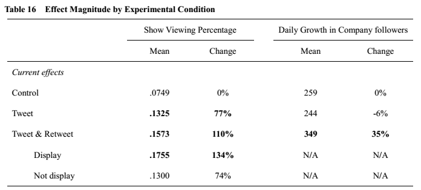
```

---
# Main Takeaways

* Tweeting: positive & significant effect
* Tweeting + Influential retweet: retweet gives a significant boost

What's the mechanism? (subtle)

* Influential tweets with broadcast time info attract new viewers
  *  Table 8 and 9
* Informative tweets (broadcast time) also attract new followers to company page

---
class: inverse, center, middle

# Advertising and Word of Mouth

---
# Can Ads Generate WoM?

**Motivation**: 20% of WoM references TV Ads

**Specific Questions**:

* Does advertising effect WoM (online and offline)?
* What about during large events (Superbowl)?

**How?**: Observational data on WoM and advertising


---
# Data and Model

536 brands, 16 product categories 

**Advertising Data**: monthly ad expenditure from Ad$pender

**Word of Mouth**: 

* TalkTrack from Keller-Fay group ('Engagement Labs' / 'TotalSocial')
* Nielsen's UGC search engine ('Nielsen McKinsey Incite')

```{r, echo = FALSE, fig.align = "center", out.width="100%"}
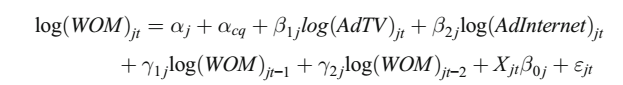
```


---
# Results

```{r, echo = FALSE, fig.align = "center", out.width="65%"}
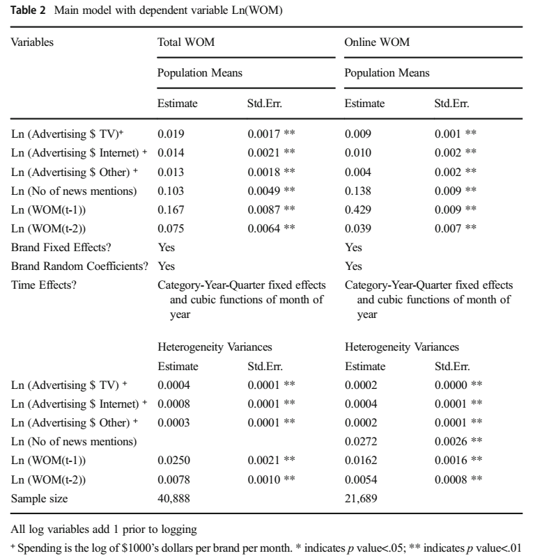
```

---
# Category Heterogeneity

```{r, echo = FALSE, fig.align = "center", out.width="100%"}
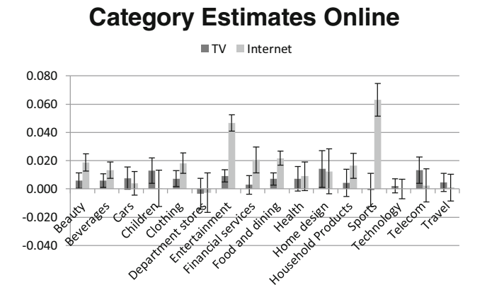
```

---
# Superbowl, Super Effect?

```{r, echo = FALSE, fig.align = "center", out.width="100%"}
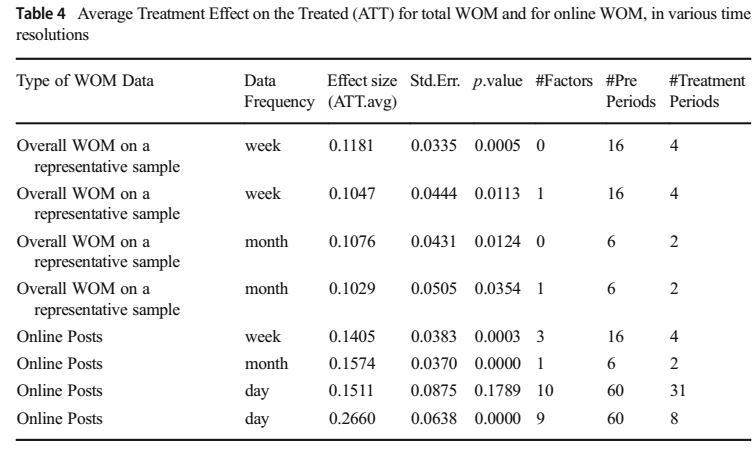
```

---
# Main Takeaways

* **Small**, positive, statistically significant effect of advertising spending on WoM 
  * Question: Is ad spend the *right* variable of interest?
* Heterogeneity across categories
  * Larger for Sports & Hobbies, Media & Entertainment, and Telecom 
* Large events have larger effects that are short-lived 

---
class: inverse, center, middle

# Recap

---
# Recap

* Measuring (digital) Ad effects is **hard**, endogeneity is everywhere
  * RCTs/experiments are our the best way forward

* Company tweets (these are ads) can generate demand, influential retweets even more
  * mechanism: attracting a new audience 

* Ads can spillover to generate (small) WoM effects
  * Question: can we quantify the effect on demand?

---
# License & Citation

Suggested Citation:

```{r, engine='out', eval = FALSE}
@misc{smwa_lecture_07,
      title={"Social Media and Web Analytics: Lecture 07"},
      author={Lachlan Deer},
      year={2021},
      url = "https://github.com/tisem-digital-marketing/smwa-lecture-07"
}
```


<p style="text-align:center;"></p>

This course adheres to the principles of the Open Science Community of Tilburg University. 
This initiative advocates for transparency and accessibility in research and teaching to all levels of society and thus creating more accountability and impact.

<p style="text-align:center;"></p>
This work is licensed under a <a rel="license" href="http://creativecommons.org/licenses/by-sa/4.0/">Creative Commons Attribution-ShareAlike 4.0 International License</a>.